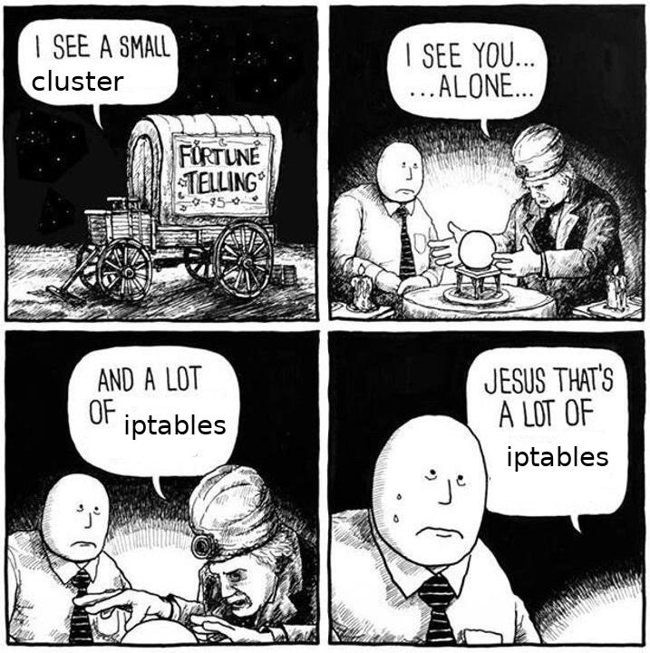

# Gimme AWS Mini

The [ec2 instance metadata service](http://docs.aws.amazon.com/AWSEC2/latest/UserGuide/ec2-instance-metadata.html)
runs on each ec2 instance and provide an api to retrieve information about the running instance as well as getting credentials based on the IAM role.

You’re developing an app for an AWS Kubernetes cluster (EKS, Kops, Kube-AWS, etc.) that relies on the EC2 Metadata Service for some part of its behavior when running in Amazon’s cloud. How do you run the same thing locally without modifying your manifests and potentially deploying your credentials to production?

Enter the Gimme AWS Mini, two simple daemonsets that when run inside your minikube will expose some of the functionality running on `http://169.254.169.254`

Just execute [run_metadata.sh](./run_metadata.sh) and you should be good to go!

## Magic IP and EC2 metadata service

Kubernetes uses IP Tables. A lot of IP tables. Hey! Let's add more! We want to have all requests inside minikube made to the EC2 Metadata service Magic IP address (`169.254.169.254`) be routed to a specific pod.

All around amazing developer KUOKA Yusuke aka [@mumoshu](http://twitter.com/mumoshu) has the very handy [kube-magic-ip-address](https://github.com/mumoshu/kube-magic-ip-address) which does this very same thing! We just need to set the host interface to minikube's `docker0` and the selector to match the pod running our fake ec2 metadata service.

## Choice of metadata services

There are two great alternative ec2 metadata services. There many more that are awful. You can pick which meets your needs best!

+ Want to STS Assume a particular role for your pods? Pick [aws-mock-metadata](#aws-mock-metadata).
+ Want your pods to run with your own credentials? Pick [fake-ec2-metadata-service](#fake-ec2-metadata-service).

### <a name="aws-mock-metadata">aws-mock-metadata</a>

The [aws-mock-metadata](https://github.com/jtblin/aws-mock-metadata) will use *your* credentials to AWS STS assume *some other role* and pass the temporary credentials to your pods via metadata service calls. Why this is pretty much how you are supposed to run your app in production!

It also provides additional features like being able to return an instance id, availability zone, etc.

If you need to STS assume a particular role, then this one is the one to use!

**NOTE**: You will need to modify this manifest for your VPC, role, etc. This expects your environment variable `AWS_ACCESS_KEY_ID` and `AWS_SECRET_ACCESS_KEY` to be set.

### <a name="fake-ec2-metadata-service">Fake EC2 Metadata Service</a>

The [Fake EC2 Metadata Service](https://github.com/bpholt/fake-ec2-metadata-service), is a simple Sinatra app that exposes some of the ec2 metadata service functionality. If you want your app to just run with your own credentials, then it should be fine. Requires no modification.

**NOTE**: Expects `$HOME/.aws/config` and `$HOME/.aws/credentials`

### Does it work outside minikube like on baremetal?
Sure! Kinda! You just need to pick a more appropriate host interface, like `cni0`, or `cbr0`, or whatever you are using. Good luck!

### A note on minikube iptables

From [Miek Gieben @miekg](https://twitter.com/miekg/status/1011585886654550016/photo/1)



## Example Requests

From a container inside your minikube, run these to test:

```
curl http://169.254.169.254/latest/meta-data/local-ipv4
curl http://169.254.169.254/latest/meta-data/local-hostname
curl http://169.254.169.254/latest/meta-data/iam/security-credentials/
curl http://169.254.169.254/latest/meta-data/iam/security-credentials/default
```

I have my own private image that I run like this:
`kubectl run --command --rm  -i --tty $(whoami) --image=$AWSCLIIMAGE --restart=Never -- /bin/bash`
